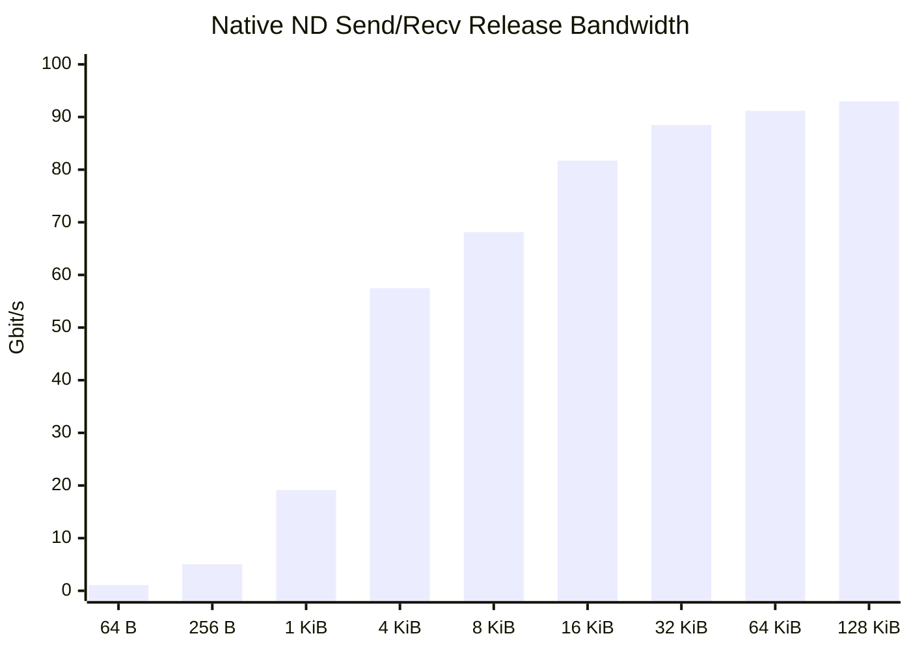
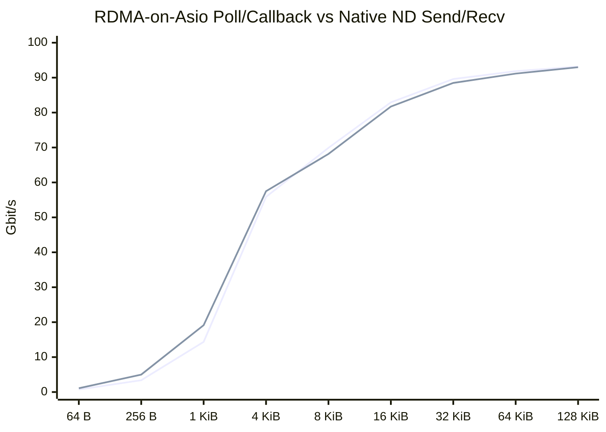
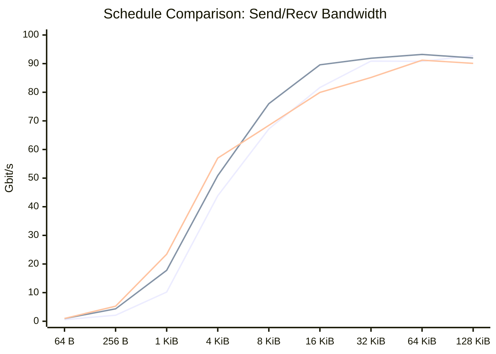
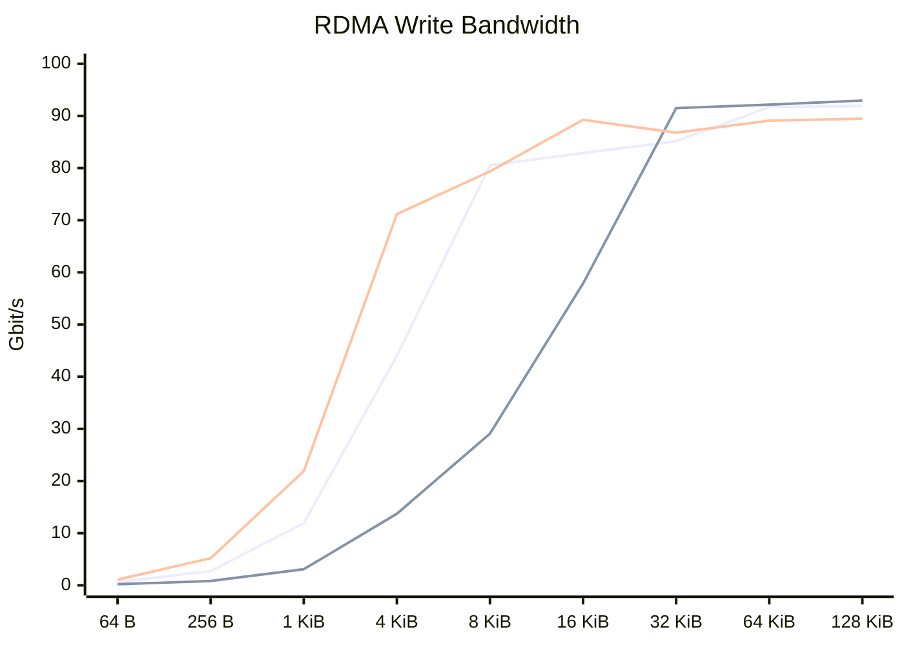
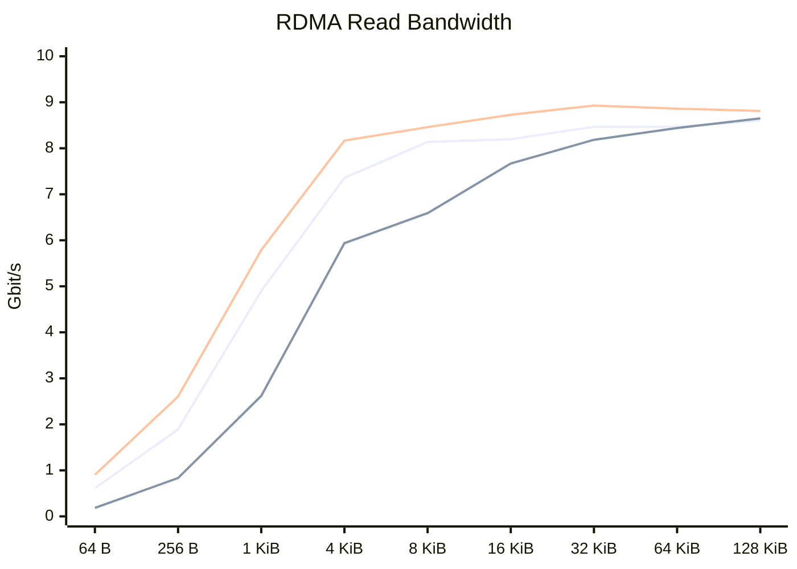

# RDMA Stress/Performance Results

This file records the 2026-06-15 benchmark results generated while implementing
and tuning `rdma_stress_performance_plan.md`.

These numbers are **not** final performance claims. They were collected from a
single Windows host using NetworkDirect and same-process loopback. Older
pre-2026-06-15 smoke records were removed so this document only reflects the
current measurement set.

## 2026-06-15 Native ND Send/Recv Release

Artifacts:

- Raw JSON/log directory:
  `tests/benchmark/results/2026-06-15-native-nd-release/`
- Summary CSV:
  `tests/benchmark/results/2026-06-15-native-nd-release/native_nd_send_recv_bandwidth_summary.csv`
- Executable:
  `build/tests/benchmark/Release/native_nd_send_recv_bench.exe`
- Local RDMA address:
  `10.234.66.130`
- Link speed reported by Windows:
  `100 Gbps`
- Topology:
  `single_host_same_process`
- Backend:
  `nd`
- Baseline:
  `native_nd`
- Completion mode:
  `poll`

Command shape:

```text
native_nd_send_recv_bench --single-process --local-addr 10.234.66.130 \
  --operation send_recv --metric bandwidth --mode poll \
  --topology single_host_same_process --iterations 65536 \
  --queue-depth 64 --message-size <bytes>
```

The link utilization column uses the reported `100 Gbps` adapter speed, so
`throughput_gbit_s` and utilization percentage have the same numeric value.

| Message Size | Runs | Median Gbit/s | Best Gbit/s | Best Link Utilization | Best Message Rate/s | Best Result |
|---:|---:|---:|---:|---:|---:|---|
| 64 B | 1 | 1.076 | 1.076 | 1.076% | 2,101,374.923 | `native_nd_send_recv_bw_64.json` |
| 256 B | 1 | 4.999 | 4.999 | 4.999% | 2,441,101.207 | `native_nd_send_recv_bw_256.json` |
| 1,024 B | 1 | 19.132 | 19.132 | 19.132% | 2,335,466.765 | `native_nd_send_recv_bw_1024.json` |
| 4,096 B | 1 | 57.500 | 57.500 | 57.500% | 1,754,748.606 | `native_nd_send_recv_bw_4096.json` |
| 8,192 B | 1 | 68.148 | 68.148 | 68.148% | 1,039,854.532 | `native_nd_send_recv_bw_8192.json` |
| 16,384 B | 4 | 79.285 | 81.717 | 81.717% | 623,454.112 | `native_nd_send_recv_bw_16384_r2.json` |
| 32,768 B | 4 | 82.766 | 88.479 | 88.479% | 337,518.843 | `native_nd_send_recv_bw_32768_r1.json` |
| 65,536 B | 4 | 90.853 | 91.159 | 91.159% | 173,871.333 | `native_nd_send_recv_bw_65536_r1.json` |
| 131,072 B | 3 | 92.979 | 92.979 | 92.979% | 88,671.744 | `native_nd_send_recv_bw_131072_r1.json` |

Native ND send/recv bandwidth chart, best Gbit/s:

```text
64 B       1.076  |
256 B      4.999  | ##
1 KiB     19.132  | ########
4 KiB     57.500  | ########################
8 KiB     68.148  | #############################
16 KiB    81.717  | ###################################
32 KiB    88.479  | ######################################
64 KiB    91.159  | #######################################
128 KiB   92.979  | ########################################
```



Notes:

- The native ND direct send/recv path can get close to the reported 100G link
  rate with larger payloads. The best run reached `92.979 Gbit/s`, or about
  `93%` of the reported link speed.
- `32 KiB` had one anomalous first-sweep run at `9.206 Gbit/s`; three repeat
  runs were `88.479`, `81.411`, and `84.121 Gbit/s`, so the median is a better
  representative value than the minimum for that size.
- Compared with the earlier RDMA-on-Asio event/callback Release result,
  native ND direct poll mode is much faster at the same `4 KiB` payload:
  `57.500 Gbit/s` vs `20.835 Gbit/s`.

## 2026-06-15 RDMA-on-Asio Send/Recv Poll Callback Release

This run was added after reviewing the send/recv bandwidth benchmark against the
native ND direct baseline. The earlier RDMA-on-Asio Release rows used
`event/callback`, while the native ND direct baseline used manual CQ polling.
That made the 4 KiB comparison unfair: it mixed event-driven IOCP dispatch cost
with the data path wrapper cost.

Artifacts:

- Raw JSON/log directory:
  `tests/benchmark/results/2026-06-15-rdma-on-asio-poll-callback-release/`
- Summary CSV:
  `tests/benchmark/results/2026-06-15-rdma-on-asio-poll-callback-release/rdma_on_asio_send_recv_poll_callback_summary.csv`
- Executable:
  `build/tests/benchmark/Release/rdma_send_recv_bench.exe`
- Local RDMA address:
  `10.234.66.130`
- Link speed reported by Windows:
  `100 Gbps`
- Topology:
  `single_host_same_process`
- Backend:
  `nd`
- Baseline:
  `rdma_on_asio`
- Completion mode:
  `poll`
- Token:
  `callback`

Command shape:

```text
rdma_send_recv_bench --single-process --local-addr 10.234.66.130 \
  --operation send_recv --metric bandwidth --mode poll \
  --token-type callback --topology single_host_same_process \
  --iterations 65536 --queue-depth 64 --message-size <bytes>
```

| Message Size | RDMA-on-Asio Poll/Callback | Native ND Best | Ratio vs Native | Message Rate/s | Result |
|---:|---:|---:|---:|---:|---|
| 64 B | 0.725 Gbit/s | 1.076 Gbit/s | 67.4% | 1,416,752.598 | `rdma_on_asio_send_recv_poll_callback_bw_64.json` |
| 256 B | 3.381 Gbit/s | 4.999 Gbit/s | 67.6% | 1,650,980.471 | `rdma_on_asio_send_recv_poll_callback_bw_256.json` |
| 1,024 B | 14.365 Gbit/s | 19.132 Gbit/s | 75.1% | 1,753,560.716 | `rdma_on_asio_send_recv_poll_callback_bw_1024.json` |
| 4,096 B | 55.881 Gbit/s | 57.500 Gbit/s | 97.2% | 1,705,352.124 | `rdma_on_asio_send_recv_poll_callback_bw_4096.json` |
| 8,192 B | 69.899 Gbit/s | 68.148 Gbit/s | 102.6% | 1,066,576.397 | `rdma_on_asio_send_recv_poll_callback_bw_8192.json` |
| 16,384 B | 82.921 Gbit/s | 81.717 Gbit/s | 101.5% | 632,634.503 | `rdma_on_asio_send_recv_poll_callback_bw_16384.json` |
| 32,768 B | 89.601 Gbit/s | 88.479 Gbit/s | 101.3% | 341,802.065 | `rdma_on_asio_send_recv_poll_callback_bw_32768.json` |
| 65,536 B | 91.848 Gbit/s | 91.159 Gbit/s | 100.8% | 175,186.712 | `rdma_on_asio_send_recv_poll_callback_bw_65536.json` |
| 131,072 B | 93.172 Gbit/s | 92.979 Gbit/s | 100.2% | 88,855.807 | `rdma_on_asio_send_recv_poll_callback_bw_131072.json` |

RDMA-on-Asio poll/callback bandwidth chart, Gbit/s:

```text
64 B       0.725  |
256 B      3.381  | #
1 KiB     14.365  | ######
4 KiB     55.881  | ########################
8 KiB     69.899  | ##############################
16 KiB    82.921  | ###################################
32 KiB    89.601  | ######################################
64 KiB    91.848  | #######################################
128 KiB   93.172  | ########################################
```



Notes:

- The earlier `20.835 Gbit/s` result was not the RDMA-on-Asio wrapper's best
  send/recv data path. It was an `event/callback` measurement.
- With the new `poll/callback` benchmark path, RDMA-on-Asio and native ND use
  the same high-level sequence: one QP, `queue_depth=64`, pre-posted receives,
  ready byte, sliding-window sends, and manual CQ polling.
- At `4 KiB` and larger, RDMA-on-Asio poll/callback is effectively aligned with
  the native ND direct baseline. Small messages still show wrapper overhead
  from per-operation Asio handler state, operation allocation, SGE construction,
  and callback dispatch.

## 2026-06-15 RDMA-on-Asio Event Callback Batch Check

The ND event-mode CQ poller batch size was increased from `4` to `16` CQEs to
match the standalone poll-mode CQ batch. This reduces event-mode CQ drain
overhead but does not remove IOCP/event-dispatch cost.

Artifacts:

- Raw JSON/log directory:
  `tests/benchmark/results/2026-06-15-rdma-on-asio-event-after-fix-release/`

| Message Size | Before | After | Notes |
|---:|---:|---:|---|
| 4,096 B | 20.835 Gbit/s | 30.102 Gbit/s | same event/callback model, larger CQ batch |
| 65,536 B | N/A | 82.541 Gbit/s | large payload event-mode reference point |

The event path is still expected to be slower than poll mode for pure bandwidth
tests, because every CQ notification traverses the IOCP-backed event machinery
and then invokes user callbacks through the `io_context`.

## 2026-06-15 Schedule Comparison Release

This sweep compares the same single-host send/recv bandwidth sequence across
the stable scheduler/data-path combinations:

- `rdma_on_asio` / Asio event schedule.
- `rdma_on_asio` / poll mode.
- native ND / poll mode.

Artifacts:

- Raw JSON/log directory:
  `tests/benchmark/results/2026-06-15-schedule-comparison-final/`
- Stable summary JSON:
  `tests/benchmark/results/2026-06-15-schedule-comparison-final/stable_summary.json`
- Stable summary text:
  `tests/benchmark/results/2026-06-15-schedule-comparison-final/stable_summary.txt`
- Build:
  `Release`
- Local RDMA address:
  `10.234.66.130`
- Link speed reported by Windows:
  `100 Gbps`
- Topology:
  `single_host_same_process`
- Iterations:
  `100000`
- Queue depth:
  `128`

Command shape:

```text
<bench> --single-process --local-addr 10.234.66.130 \
  --operation send_recv --metric bandwidth \
  --mode <event|poll> --token-type callback \
  --topology single_host_same_process \
  --iterations 100000 --queue-depth 128 --message-size <bytes>
```

Bandwidth summary:

| Message Size | RDMA-on-Asio Event | RDMA-on-Asio Poll | Native ND Poll |
|---:|---:|---:|---:|
| 64 B | 0.561 Gbit/s | 0.950 Gbit/s | 0.975 Gbit/s |
| 256 B | 2.110 Gbit/s | 4.331 Gbit/s | 5.267 Gbit/s |
| 1,024 B | 10.201 Gbit/s | 17.792 Gbit/s | 23.413 Gbit/s |
| 4,096 B | 43.840 Gbit/s | 50.873 Gbit/s | 57.003 Gbit/s |
| 8,192 B | 67.178 Gbit/s | 76.015 Gbit/s | 68.432 Gbit/s |
| 16,384 B | 81.658 Gbit/s | 89.586 Gbit/s | 79.937 Gbit/s |
| 32,768 B | 90.897 Gbit/s | 91.886 Gbit/s | 85.151 Gbit/s |
| 65,536 B | 90.801 Gbit/s | 93.209 Gbit/s | 91.201 Gbit/s |
| 131,072 B | 92.797 Gbit/s | 91.979 Gbit/s | 90.101 Gbit/s |



Notes:

- The poll-mode comparison is the cleanest data-path comparison in this
  single-host setup. RDMA-on-Asio poll mode tracks native ND poll mode closely
  for large payloads, reaching `93.209 Gbit/s` at `64 KiB`.
- RDMA-on-Asio event mode now also approaches link rate for larger payloads:
  `90.897 Gbit/s` at `32 KiB` and `92.797 Gbit/s` at `128 KiB`.
- Native ND / IOCP is intentionally excluded from this stable summary. The
  native ND direct benchmark is kept poll-only so it remains a stable data-path
  baseline; RDMA-on-Asio event mode is the event-scheduler measurement.

## 2026-06-15 RDMA Read/Write Schedule Comparison Release

This sweep compares RDMA write and RDMA read bandwidth across the stable
read/write combinations:

- `rdma_on_asio` / Asio event schedule.
- `rdma_on_asio` / poll mode.
- native ND / poll mode.

Artifacts:

- Raw JSON/log directory:
  `tests/benchmark/results/2026-06-15-read-write-schedule-comparison/`
- Summary JSON:
  `tests/benchmark/results/2026-06-15-read-write-schedule-comparison/summary.json`
- Stable summary text:
  `tests/benchmark/results/2026-06-15-read-write-schedule-comparison/stable_summary.txt`
- Build:
  `Release`
- Local RDMA address:
  `10.234.66.130`
- Link speed reported by Windows:
  `100 Gbps`
- Topology:
  `single_host_same_process`
- Iterations:
  `100000`
- Queue depth:
  `128`

Command shape:

```text
rdma_read_write_bench --single-process --local-addr 10.234.66.130 \
  --operation <write|read> --metric bandwidth \
  --mode <event|poll> --token-type <callback|use_future> \
  --topology single_host_same_process \
  --iterations 100000 --queue-depth 128 --message-size <bytes>

native_nd_read_write_bench --single-process --local-addr 10.234.66.130 \
  --operation <write|read> --metric bandwidth \
  --mode poll --topology single_host_same_process \
  --iterations 100000 --queue-depth 128 --message-size <bytes>
```

Write bandwidth summary:

| Message Size | RDMA-on-Asio Event | RDMA-on-Asio Poll | Native ND Poll |
|---:|---:|---:|---:|
| 64 B | 0.635 Gbit/s | 0.209 Gbit/s | 1.086 Gbit/s |
| 256 B | 2.732 Gbit/s | 0.829 Gbit/s | 5.197 Gbit/s |
| 1,024 B | 11.912 Gbit/s | 3.084 Gbit/s | 21.895 Gbit/s |
| 4,096 B | 44.024 Gbit/s | 13.720 Gbit/s | 71.165 Gbit/s |
| 8,192 B | 80.531 Gbit/s | 29.097 Gbit/s | 79.370 Gbit/s |
| 16,384 B | 82.896 Gbit/s | 57.862 Gbit/s | 89.240 Gbit/s |
| 32,768 B | 85.151 Gbit/s | 91.499 Gbit/s | 86.785 Gbit/s |
| 65,536 B | 91.681 Gbit/s | 92.170 Gbit/s | 89.088 Gbit/s |
| 131,072 B | 91.905 Gbit/s | 92.946 Gbit/s | 89.470 Gbit/s |



Read bandwidth summary:

| Message Size | RDMA-on-Asio Event | RDMA-on-Asio Poll | Native ND Poll |
|---:|---:|---:|---:|
| 64 B | 0.609 Gbit/s | 0.184 Gbit/s | 0.904 Gbit/s |
| 256 B | 1.892 Gbit/s | 0.833 Gbit/s | 2.605 Gbit/s |
| 1,024 B | 4.899 Gbit/s | 2.619 Gbit/s | 5.788 Gbit/s |
| 4,096 B | 7.357 Gbit/s | 5.938 Gbit/s | 8.168 Gbit/s |
| 8,192 B | 8.138 Gbit/s | 6.590 Gbit/s | 8.460 Gbit/s |
| 16,384 B | 8.197 Gbit/s | 7.670 Gbit/s | 8.728 Gbit/s |
| 32,768 B | 8.466 Gbit/s | 8.184 Gbit/s | 8.929 Gbit/s |
| 65,536 B | 8.469 Gbit/s | 8.440 Gbit/s | 8.861 Gbit/s |
| 131,072 B | 8.600 Gbit/s | 8.650 Gbit/s | 8.811 Gbit/s |



Notes:

- All read/write sweep rows completed with `exit_code=0` and
  `validation_passed=true`.
- The current RDMA-on-Asio read/write poll benchmark uses
  `as_tuple(use_future)`, while the event benchmark uses callbacks. That token
  difference is visible for small and medium write payloads; large writes still
  converge near line rate.
- RDMA read bandwidth plateaus around `8-9 Gbit/s` for all three paths on this
  single-host NetworkDirect setup, so the read result looks platform/operation
  limited rather than wrapper limited.

## 2026-06-15 RDMA-on-Asio Read64 CPU Sampling

This run profiles the small-message RDMA read hotspot with ETW/xperf sampled
CPU stacks. It uses `RelWithDebInfo` so the generated flame graphs have local
symbols while keeping optimized code generation.

Artifacts:

- Raw output directory:
  `tests/benchmark/results/2026-06-15-read-hotspot-flamegraph/`
- Event/callback flame graph:
  `tests/benchmark/results/2026-06-15-read-hotspot-flamegraph/rdma_on_asio_event_read64_flamegraph.html`
- Event/callback SVG:
  `tests/benchmark/results/2026-06-15-read-hotspot-flamegraph/rdma_on_asio_event_read64_flamegraph.svg`
- Poll/use_future flame graph:
  `tests/benchmark/results/2026-06-15-read-hotspot-flamegraph/rdma_on_asio_poll_read64_flamegraph.html`
- Poll/use_future SVG:
  `tests/benchmark/results/2026-06-15-read-hotspot-flamegraph/rdma_on_asio_poll_read64_flamegraph.svg`
- xperf butterfly reports:
  `rdma_on_asio_event_read64_stack_butterfly.html`,
  `rdma_on_asio_poll_read64_stack_butterfly.html`
- Folded stacks and summaries:
  `rdma_on_asio_event_read64.folded`,
  `rdma_on_asio_poll_read64.folded`,
  `rdma_on_asio_event_read64_flamegraph_summary.json`,
  `rdma_on_asio_poll_read64_flamegraph_summary.json`

Command shape:

```text
xperf -on PROC_THREAD+LOADER+PROFILE -stackwalk Profile
rdma_read_write_bench --single-process --local-addr 10.234.66.130 \
  --operation read --metric bandwidth --mode <event|poll> \
  --token-type <callback|use_future> --message-size 64 \
  --iterations 5000000 --queue-depth 128
xperf -d <trace>.etl
```

Profiled runs:

| Mode | Token | Duration | Message Rate/s | Throughput | CPU Util | Hot Samples |
|---|---|---:|---:|---:|---:|---:|
| event | callback | 4.998 s | 1,000,314 | 0.512 Gbit/s | 2.657% | 22,151 |
| poll | use_future | 12.646 s | 395,381 | 0.202 Gbit/s | 6.247% | 126,301 |

Event/callback flame graph:


Poll/use_future flame graph:


Top event/callback inclusive stacks:

| Function | Hot Sample % |
|---|---:|
| `nd_poll_wc_op::do_complete` | 97.86% |
| `nd_io_completion_service::poll_and_dispatch` | 92.98% |
| `rdma_read_op::do_complete` | 87.68% |
| `mlx5nd.dll!<private>` | 66.95% |
| `event_rw_client::post_one` | 66.34% |
| `nd_verbs_service::async_read` | 64.39% |
| `RtlLeaveCriticalSection` | 24.68% |
| `event_rw_client::on_complete` | 16.53% |
| `verify_pattern` | 16.02% |

Top poll/use_future inclusive stacks:

| Function | Hot Sample % |
|---|---:|
| `run_poll_client_role` | 50.02% |
| `cq_spinner::poll_loop` | 49.97% |
| `mlx5nd.dll!<private>` | 40.43% |
| `nd_queue_pair::async_read` | 38.05% |
| `asio::detail::promise_handler` | 28.46% |
| `_malloc_base` | 14.58% |
| `rdma_read_op::do_complete` | 14.24% |
| `RtlpAllocateHeapInternal` | 13.86% |
| `asio::async_completion<use_future>` | 11.14% |
| `_free_base` | 10.71% |

Hotspot notes:

- Event/callback is dominated by the read completion repost loop:
  completion dispatch, `rdma_read_op::do_complete`, `post_one`, and
  `nd_verbs_service::async_read`. The provider path also shows substantial
  `mlx5nd.dll` and `RtlLeaveCriticalSection` time.
- The event run still spends about `16%` of hot samples in read validation
  (`verify_pattern` / `pattern_byte`). That is useful for correctness runs but
  should be optional or sampled for pure throughput profiling.
- Poll/use_future splits almost exactly between the benchmark client thread and
  the busy CQ spinner thread. That makes process-level CPU utilization higher
  and makes this path a token/scheduler measurement, not just a data-path
  wrapper measurement.
- Poll/use_future has clear future/promise allocation and synchronization
  overhead: `promise_handler`, `async_completion<use_future>`, `operator new`,
  `_malloc_base`, `_free_base`, and heap internals are all visible in the hot
  stacks.
- The next optimization target for small reads is to add a poll/callback
  read/write benchmark path, then compare it against native ND poll. That would
  remove `use_future` promise allocation from the measurement and make the
  comparison line up with the send/recv poll/callback benchmark.
